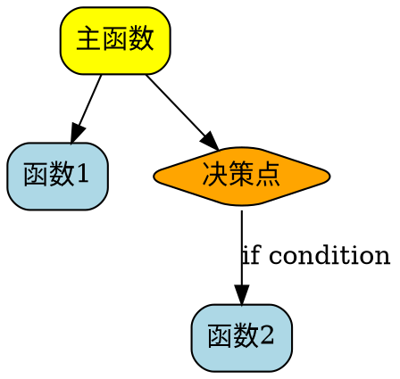

# UVM调用图快速参考

## 已生成的调用图

### 1. Fault Service调用图 (WIC最相关)
- **文件**: `uvm_fault_callgraph.svg` / `.png`
- **显示内容**:
  - `uvm_parent_gpu_service_replayable_faults()` 完整调用流程
  - **Replay Policy决策点** (Line 2986-3007) ⭐
  - **Flush Mode决策点** (Line 2995) ⭐
  - HAL回调扩展点

### 2. Thrashing Policy调用图
- **文件**: `uvm_thrashing_callgraph.svg` / `.png`
- **显示内容**:
  - `uvm_perf_thrashing_get_hint()` API流程
  - **PIN vs THROTTLE决策逻辑** ⭐
  - 8个module parameters的使用位置
  - Hint应用点

## 查看方法

### 方法1: 浏览器查看 (推荐)
```bash
# SVG可缩放，推荐
firefox uvm_fault_callgraph.svg
firefox uvm_thrashing_callgraph.svg

# 或Chrome
google-chrome uvm_fault_callgraph.svg
```

### 方法2: 图片查看器
```bash
eog uvm_fault_callgraph.png  # GNOME
feh uvm_fault_callgraph.png  # 轻量级
```

### 方法3: VSCode
```bash
code uvm_fault_callgraph.svg  # VSCode有SVG预览插件
```

## 关键发现 (从调用图)

### Fault Service流程 (uvm_fault_callgraph.svg)

```
uvm_parent_gpu_service_replayable_faults (入口)
  │
  ├─> uvm_tracker_init (初始化)
  │
  ├─> [主循环] while(1)
  │   │
  │   ├─> fetch_fault_buffer_entries() [Line 2933]
  │   │   └─> 从硬件读取fault entries
  │   │
  │   ├─> preprocess_fault_batch() [Line 2942]
  │   │   └─> 分类、检查重复、检查限流
  │   │
  │   ├─> service_fault_batch() [Line 2951] ⭐核心
  │   │   └─> service_managed_fault_in_block()
  │   │       └─> uvm_va_block_make_resident()
  │   │           └─> Migration决策！
  │   │
  │   └─> ⭐⭐⭐ Replay Policy Decision [Line 2986] ⭐⭐⭐
  │       │
  │       ├─> [if BATCH] push_replay_on_parent_gpu()
  │       │   └─> parent_gpu->host_hal->replay_faults() [HAL扩展点]
  │       │
  │       ├─> [if BATCH_FLUSH] fault_buffer_flush_locked()
  │       │   └─> ⭐ Flush Mode Decision [Line 2995]:
  │       │       if (duplicates * 100 > total * replay_update_put_ratio)
  │       │           flush_mode = UPDATE_PUT;  // 更新PUT指针
  │       │       else
  │       │           flush_mode = CACHED_PUT;  // 使用缓存
  │       │
  │       └─> [if ONCE] 推迟到最后
  │
  └─> [循环结束] Final Replay [Line 3020]
      └─> if (num_replays == 0 || policy == ONCE)
          └─> push_replay_on_parent_gpu()
```

### Thrashing Detection流程 (uvm_thrashing_callgraph.svg)

```
uvm_perf_thrashing_get_hint (API入口)
  │
  ├─> [1] Check: if (uvm_perf_thrashing_enable == 0) return NONE
  │
  ├─> [2] thrashing_info_get() 获取VA block的thrashing数据
  │
  ├─> [3] thrashing_detected() 检查是否在thrashing
  │   └─> 检查: fault_count > uvm_perf_thrashing_threshold (默认3)
  │
  └─> [4] ⭐ Policy Decision: PIN or THROTTLE? ⭐
      │
      ├─> [PIN分支]
      │   └─> if (fault_count > uvm_perf_thrashing_pin_threshold [默认10])
      │       └─> hint.type = PIN
      │           hint.pin.residency = preferred_location
      │           hint.pin.processors = mask
      │
      └─> [THROTTLE分支]
          └─> else
              └─> hint.type = THROTTLE
                  hint.throttle.end_time = now + (nap * epoch_count)
                  └─> nap = uvm_perf_thrashing_nap [默认100us]

调用者使用hint:
  service_fault_batch()
    └─> if (hint.type == PIN)
            Map remotely, avoid migration
        else if (hint.type == THROTTLE)
            Sleep until end_time
```

## 关键Policy决策点总结

### 1. Replay Policy决策 (Line 2986)
```c
if (replayable_faults->replay_policy == UVM_PERF_FAULT_REPLAY_POLICY_BATCH) {
    // [+] 可以在这里加 EBPF 判断
    push_replay_on_parent_gpu(parent_gpu, UVM_FAULT_REPLAY_TYPE_START, batch_context);
}
else if (replayable_faults->replay_policy == UVM_PERF_FAULT_REPLAY_POLICY_BATCH_FLUSH) {
    // Flush mode决策 (Line 2995)
    if (batch_context->num_duplicate_faults * 100 >
        batch_context->num_cached_faults * replayable_faults->replay_update_put_ratio) {
        flush_mode = UVM_GPU_BUFFER_FLUSH_MODE_UPDATE_PUT;
    } else {
        flush_mode = UVM_GPU_BUFFER_FLUSH_MODE_CACHED_PUT;
    }
    fault_buffer_flush_locked(parent_gpu, NULL, flush_mode, ...);
}
```

### 2. Thrashing Hint决策
```c
uvm_perf_thrashing_hint_t hint = uvm_perf_thrashing_get_hint(va_block, ...);

if (hint.type == UVM_PERF_THRASHING_HINT_TYPE_PIN) {
    // PIN策略：远程映射，避免迁移
    // 基于: fault_count > pin_threshold
}
else if (hint.type == UVM_PERF_THRASHING_HINT_TYPE_THROTTLE) {
    // THROTTLE策略：延迟处理
    // 等待到: hint.throttle.end_time
}
```

### 3. HAL扩展点
```c
// Replay通过HAL层调用，可以替换实现
parent_gpu->host_hal->replay_faults(parent_gpu, UVM_FAULT_REPLAY_TYPE_START);

// HAL定义在 uvm_hal.h:779-811
struct uvm_host_hal_struct {
    uvm_hal_fault_buffer_replay_t replay_faults;  // ⭐可以挂eBPF
    uvm_hal_fault_cancel_global_t cancel_faults_global;
    // ... 60+ more callbacks
};
```

## 如何生成更多调用图

### 使用提供的脚本
```bash
cd /home/yunwei37/open-gpu-kernel-modules/kernel-open/nvidia-uvm

# 生成特定函数的调用图
python3 /tmp/simple_callgraph.py uvm_perf_prefetch.c \
    uvm_perf_prefetch_get_hint --dot | \
    dot -Tsvg -o prefetch_callgraph.svg

# 查看所有函数调用
python3 /tmp/simple_callgraph.py uvm_gpu_replayable_faults.c | less
```

### 手工创建DOT文件
参考 `uvm_fault_callgraph.dot` 和 `uvm_thrashing_callgraph.dot`

模板：


转换为图片：
```bash
dot -Tpng my_callgraph.dot -o my_callgraph.png
dot -Tsvg my_callgraph.dot -o my_callgraph.svg
```

## 配合WIC论文使用

### Interrupter模块 → 查看 `uvm_fault_callgraph.svg`
- 重点看 Replay Policy Decision (黄色菱形)
- 找到 Line 2986-3007 的决策逻辑
- 注意 HAL callback point (粉色框)

### Monitor模块 → 查看 `uvm_thrashing_callgraph.svg`
- 重点看 PIN vs THROTTLE 决策 (橙色菱形)
- 8个module parameters的作用
- 理解hint的使用流程

### Activator模块 → 需要生成prefetch调用图
```bash
# 生成prefetch调用图
grep -n "prefetch" kernel-open/nvidia-uvm/uvm_perf_prefetch.c | head -20
# 然后创建对应的DOT文件
```

## 进阶: 动态追踪实际调用

### 使用ftrace
```bash
sudo su
cd /sys/kernel/debug/tracing
echo function_graph > current_tracer
echo 'uvm_parent_gpu_service_replayable_faults' > set_ftrace_filter
echo 1 > tracing_on

# 运行CUDA程序触发fault

echo 0 > tracing_on
cat trace > /tmp/uvm_runtime_trace.txt
```

### 使用bpftrace
```bash
# 统计replay调用次数
sudo bpftrace -e '
kprobe:push_replay_on_parent_gpu {
    @replays[kstack] = count();
}
END {
    print(@replays);
}
'

# 追踪thrashing hint
sudo bpftrace -e '
kretprobe:uvm_perf_thrashing_get_hint {
    printf("Hint type: %d\n", retval);
}
'
```

## 图例说明

在生成的调用图中：

- **黄色框** = Policy决策点或入口函数
- **橙色框** = 核心处理逻辑
- **绿色框** = PIN策略相关
- **珊瑚色框** = THROTTLE策略相关
- **粉色框** = HAL扩展点，可挂eBPF
- **菱形** = 条件判断/决策点
- **椭圆** = 循环结构

## 总结

生成的两个调用图清晰展示了：

1. **Fault Service流程**: 从fault到replay的完整路径，包含2个关键policy决策点
2. **Thrashing Detection**: PIN/THROTTLE策略的完整决策逻辑

这些调用图可以直接用于：
- 理解UVM driver的工作流程
- 找到eBPF hook的插入点
- 理解WIC论文的实现机制
- 设计自定义policy

**所有调用图文件都在项目根目录，可以直接用浏览器打开SVG文件查看！**
